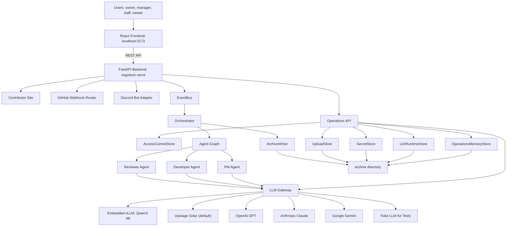
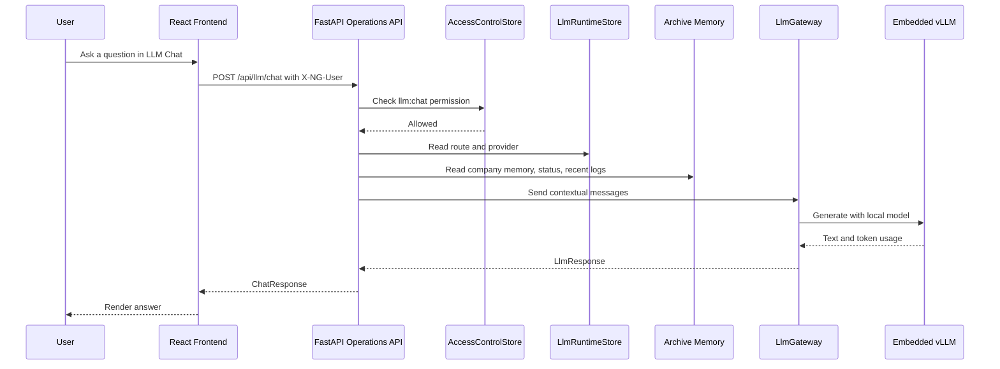
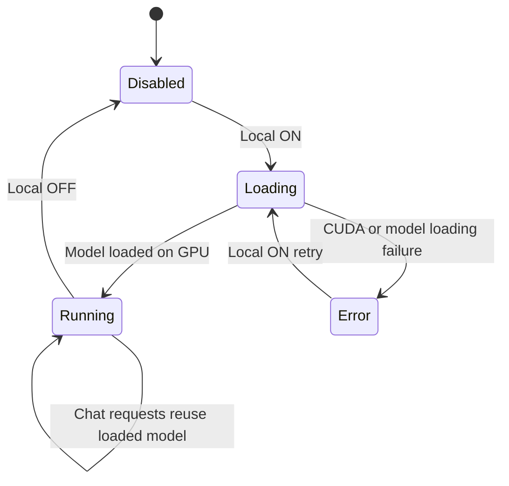
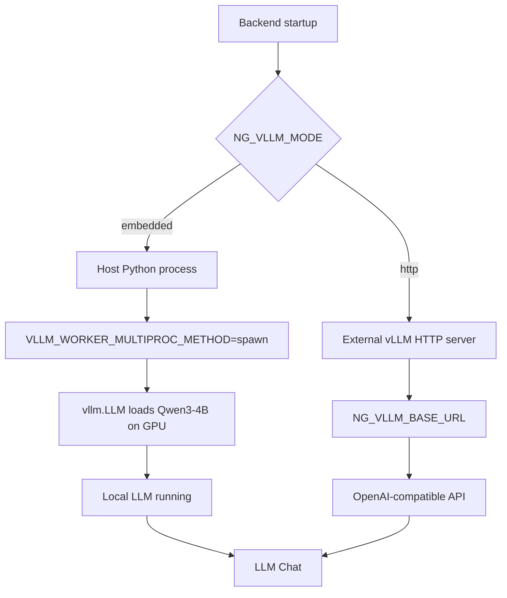
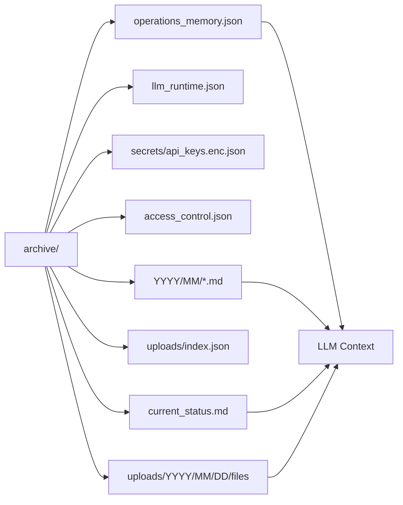
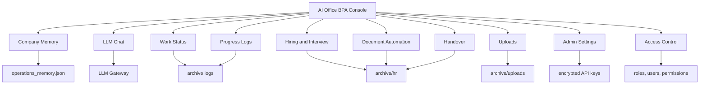
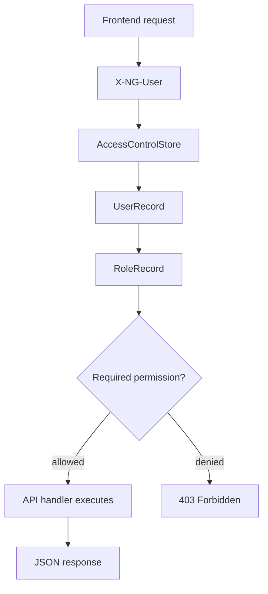
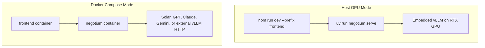

# Negotium Architecture

Negotium is an AI Office BPA system that combines a React console, a FastAPI backend, local/cloud LLM routing, external ingestion, and a Markdown-first archive.

## 1. System Overview



## 2. Main Request Flow



## 3. Local vLLM State



## 4. LLM Runtime Modes



Recommended local GPU mode:

```bash
NG_LLM_PROVIDER=vllm \
NG_LLM_DEFAULT_ROUTE=local \
NG_VLLM_MODE=embedded \
NG_VLLM_PRELOAD_ON_STARTUP=true \
NG_VLLM_WORKER_MULTIPROC_METHOD=spawn \
uv run negotium serve
```

Docker mode is for the frontend and non-GPU backend operation. It does not load the embedded local GPU model.

## 5. Archive and Persistence



## 6. Office BPA Feature Map



## 7. Event Ingestion and Agent Flow

```mermaid
flowchart LR
  Github["GitHub Issue or Webhook"] --> GithubRouter["GitHubWebhookRouter"]
  Discord["Discord Message"] --> DiscordAdapter["DiscordBotAdapter"]

  GithubRouter --> EventBus["EventBus"]
  DiscordAdapter --> EventBus

  EventBus --> Orchestrator["Orchestrator"]
  Orchestrator --> Context["Repo Snapshot and Archive Context"]
  Context --> AgentGraph["AgentGraph"]

  AgentGraph --> PM["PM Agent: WorkSpec"]
  PM --> Dev["Developer Agent: PatchProposal"]
  Dev --> Reviewer["Reviewer Agent: ReviewVerdict"]
  Reviewer --> ArchiveWriter["ArchiveWriter"]
  ArchiveWriter --> Archive["archive/YYYY/MM/*.md"]
```



## 8. Access Control



Default roles:

- `owner`: all permissions via `*`
- `manager`: memory, LLM chat, documents, uploads, work read
- `staff`: LLM chat, uploads, work read
- `viewer`: work read only

## 9. Deployment Shape



Host GPU mode is the recommended mode for sensitive local LLM usage. Docker mode is suitable for web UI, API integration, and cloud-provider workflows.
